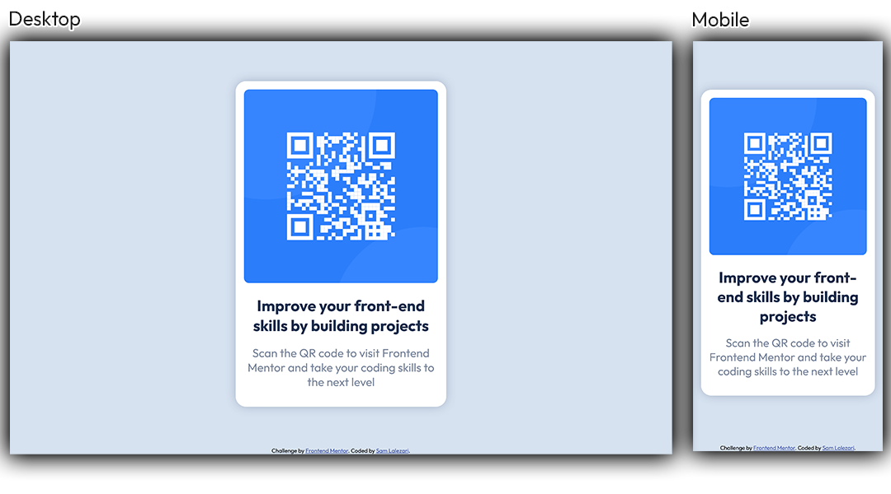

# Frontend Mentor - QR code component solution

This is a solution to the [QR code component challenge on Frontend Mentor](https://www.frontendmentor.io/challenges/qr-code-component-iux_sIO_H). Frontend Mentor challenges help you improve your coding skills by building realistic projects. 

## Table of contents

- [Author](#author)
- [Overview](#overview)
  - [Links](#links)
  - [Screenshot](#screenshot)
  - [Built with](#built-with)

## Author

- Website - [samlalezari.com](https://samlalezari.com)
- Frontend Mentor - [@lalezaris](https://www.frontendmentor.io/profile/lalezaris)

## Overview

### Links

- Solution URL: [Add solution URL here](https://github.com/lalezaris/frontend-mentor-00-qr-code-component)
- Live Site URL: [samlalezari.com/frontend-mentor-00-qr-code-component](https://samlalezari.com/frontend-mentor-00-qr-code-component/)

### Built with

- Semantic HTML5
- CSS
  - Flexbox

### Screenshot

